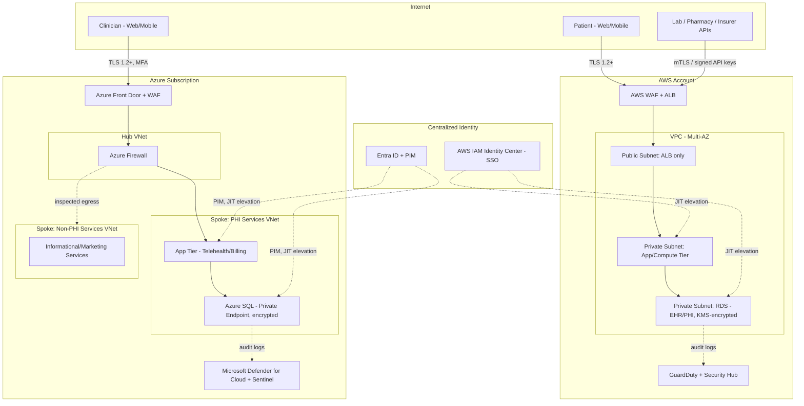
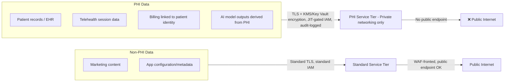

# Architecture Diagrams

## 1. Multi-Cloud Network Topology (AWS + Azure)



## 2. Identity & Access Flow (Zero Trust)

```mermaid
sequenceDiagram
    participant User as Clinician/Engineer
    participant IdP as Entra ID / IAM Identity Center
    participant PIM as PIM / JIT Elevation
    participant Resource as PHI-Tier Resource
    participant Log as Audit Log (CloudTrail / Activity Log)

    User->>IdP: Authenticate (MFA + device posture check)
    IdP-->>User: Short-lived token (standard role, read-only)
    User->>PIM: Request elevation (justification required)
    PIM->>PIM: Evaluate policy (role eligibility, approval if required)
    PIM-->>User: Time-bound elevated token (e.g., 1 hour)
    User->>Resource: Access request with elevated token
    Resource->>Log: Record access (identity, scope, timestamp)
    Resource-->>User: Grant scoped access
    Note over PIM,Resource: Elevation auto-expires; standing access reverts to read-only
```

## 3. Data Classification & Flow



## Notes

- All PHI-tier resources sit in private subnets/spokes with no public endpoint, consistent with ADR 0001 and ADR 0002.
- The AWS and Azure environments are architecturally symmetric (WAF → app tier → private data tier) so the same policy-as-code rules (Phase 2) can apply to both with minimal cloud-specific branching.
- Diagrams render directly in GitHub via Mermaid — no external tooling required to view them.
